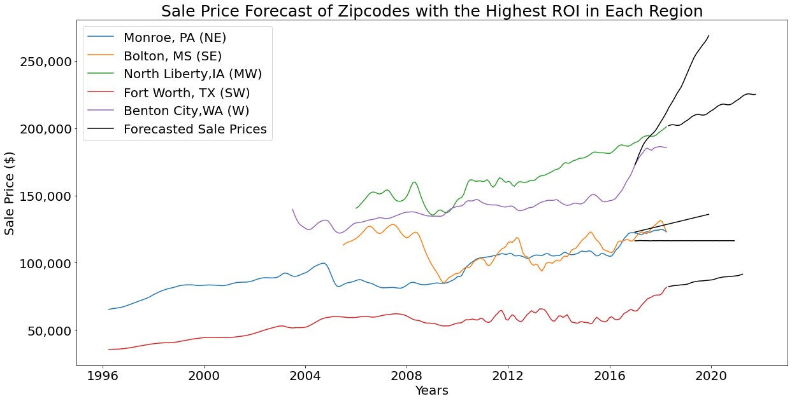

# Top 5 ZipCodes in the United States using Zillow Data

## Project Team:
 - [**Samira Chatrathi**](https://github.com/sgchatrathi)
 - [**Elijah Jarocki**](https://github.com/ejarocki)
 - [**Soo Ho (John) Park**](https://github.com/soohojp)

# Overview
As a team we worked to do a time series analysis for 5 separate regions accross the United States. We tested for stationarity by conducting an AD-Fuller test to determine which modeling technique would be the most beneficial for each specific region. Our models are represented as Model A, B, C, D, and E. A, B, and C using ARIMA modeling while D and E implemented SARIMA modeling.

## Navigating the Repository
All separate model notebooks for this project  can be found in the folder labeled [drafts](https://github.com/soohojp/Phase4_Project/tree/main/time-series/drafts) Each model was coded individually and then compiled into the [master notebook](https://github.com/soohojp/Phase4_Project/blob/main/time-series/Final_Notebook_compiled_1stdraft.ipynb) John completed Model A and D. Samira completed Model B and E. Elijah completed model C. All images used in this README.md can be found in the [photos](https://github.com/soohojp/Phase4_Project/tree/main/time-series/photos) folder where each forecast is plotted and can be viewed individually. The Presentation can also be found in the time series folder under [presentation](https://github.com/soohojp/Phase4_Project/blob/main/time-series/Zillow%20Zipcode%20Presentation.pdf).

# Business Understanding and Stakeholder

In this project we work with Zillow Data from the years 1996 to 2018 to see which would be the best 5 zipcodes across the United States of America. Our definition of "best" is a zipcode that not only gives the best return on investment for the long term but is also stable. Our stakeholder is Berkshire Hathaway, the real estate conglomerate looking to expand to new markets all across the United States while also looking to see which locations will spearhead their real estate clients likelihood of the best return on investment. While the fluctuations of return on investment can be rather risky, we as a team prioritized stability as a means of long term return on investment.

# Data Understanding and Feature Engineering

We gathered data from the Zillow Dataset from April of 1996 to April of 2018. Since our definition of best relies heavily on Return on Investment we feature engineered this column into our dataset. We also decided as a team to create an expansion of locations accross America as the cultural prevelance of a conglomerate like Berkshire Hathaway calls for regional distinctions. We feature engineered regions as well into our data frame. Finally, due to the housing bubble, where demand outweighs supply and leads to high pricing valuation that eventually pops and plummets the value of the home, we will be looking specifically within the years of 2009 to 2018.  

## Risk
We wanted to focus on the prices that have a coefficient of variance that is associated with a lower amount of risk. To do so, we defined our coefficient of variance as the standard deviation of an individual time series divided by the mean of that time series. We then filtered our data and limited the upper bound of this subset to 60% of CV value. Doing this ensures that the filtered time series are all stable investments without much variance. 

## Regions

We devided the zipcodes into 5 categories: West, Southwest, Midwest, Southeast, and Northeast. We then found the best investment from each region by filtering the dataset for low variance and finding the maximum ROI from each region. Our final selections were the following locations:
A: Monroe, PA
B: Bolton, MS
C: North Liberty, IA
D: Fort Worth, TX
E: Benton City, WA

## Modeling

Each of these locations was subjected to an AD Fuller test for stationarity. We found that A-C were stationary after differencing, while D & E were not stationary. We used ARIMA modeling for A-C and SARIMA modeling for D & E. All models were optimized to produce the minimum error possible. We were able to use these models to forecast value for our locations out to the year 2020. More information about the modeling process is available in the Final Notebook.

# Conclusion
Through our data processing and engineering, we separated each zipcode into different regions, which are as follows: Northeast, Southeast, Midwest, Southwest, and West. Then, in our dataset, we created a new column called `ROI`, short for return on investment, by using the average sale price of 2009 as the initial purchase price and the average sale price of the last 12 months until April 2018 as the current price. With this new metric, we pinpointed which zipcodes within each region has the highest potential for investment returns. The five zipcodes with the highest `ROI` was located in Moroe, PA for the Northeast, Bolton, MS for the Southeast, North Liberty, IA for the Midwest, Fort Worth, TX for the Southwest, and finally Benton City, WA for the West. To ensure a risk averse investment strategy, our zipcodes were selected according to a coefficient of variation below the 60th percentile.

Subsequently, we applied the ARIMA and SARIMA models to forecast the future sale price of these zipcodes. Our forecasts suggest either a stabilization of price or a 9% to 63% increase in sale price in a span of 20 months. Such an increase signifies a `$5,000` up to `$110,000` increase in sale price. Considering the upward trend in sale price, investing in the zipcodes we’ve analyze can serve as potentially lucrative opportunities for our clients. Our strategy focused on risk averseness and diversification in different regions can minimize housing crashes or drastic fluctuations in price, while also securing the potential for rising real estate prices.
